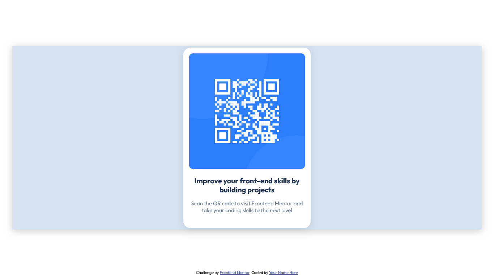

# Frontend Mentor - QR code component solution

This is a solution to the [QR code component challenge on Frontend Mentor](https://www.frontendmentor.io/challenges/qr-code-component-iux_sIO_H). Frontend Mentor challenges help me improve my coding skills by building realistic projects. 

## Table of contents

- [Overview](#overview)
  - [Screenshot](#screenshot)
  - [Links](#links)
- [My process](#my-process)
  - [Built with](#built-with)
  - [What I learned](#what-i-learned)
  - [Continued development](#continued-development)
  - [Useful resources](#useful-resources)
- [Author](#author)
- [Acknowledgments](#acknowledgments)

## Overview

### Screenshot




### Links

- Solution URL: [My Repo](https://github.com/AbbanMuhammad/QR-CODE)
- Live Site URL: [Live Preview ](https://abbanmuhammad.github.io/QR-CODE/)


### What I learned
I learned a lot from this project, amongst which are:

- I know how to use emmet in VS code
- I also learned some HTML elements like
```html
<em></em>
<div></div>
```
- Likewise, I learned some CSS properties:
```css
.box-shadow{
  box-shadow: ;
  text-shadow: ;
}
}
```

### Useful resources

- [CSS Trick](https://css-tricks.com/almanac/properties/) - This helped me a lot whenever I want to know how to use any CSS property. I really liked it.
- [W3School](https://www.w3schools.com/) - This is an amazing site which helped me understand HTML elements. I'd recommend it to anyone still learning this concept.


## Author

- Website - [Sani Ismail](https://github.com/AbbanMuhammad)
- Frontend Mentor - [@AbbanMuhammad](https://www.frontendmentor.io/profile/AbbanMuhammad)
- Twitter - [@Abuu__Muhammad](https://x.com/Abuu__Muhammad)

## Acknowledgments
I'd like to acknowledge some websites where I am really developing my skills via them. Among such are:

- [The Odin Project](https://www.theodinproject.com/)
- [Frontend Mentor](https://www.frontendmentor.io/)
